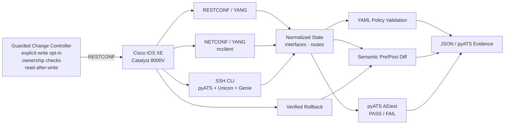

# Cisco IOS XE Network Change Validation

[](https://github.com/BrentDean/cisco-network-automation/actions/workflows/test.yml)

Python automation for **Cisco IOS XE state validation, drift detection, guarded configuration changes, rollback verification, and cross-protocol consistency checks**.

The project uses live Cisco DevNet Catalyst 8000V devices and deliberately separates safe read-only collection from explicitly enabled configuration changes.

## Recruiter / hiring manager snapshot

This repository is intended to provide concrete evidence of Cisco network-engineering and automation capability rather than a collection of one-off scripts.

| Capability | Evidence in this repository |
| --- | --- |
| Cisco IOS XE operations | Live Catalyst 8000V collection and validation |
| Network programmability | RESTCONF, NETCONF, YANG, structured JSON/XML |
| Cisco automation tooling | pyATS, Genie, Unicon, AEtest |
| Network-state reasoning | Interfaces, IPv4 addressing, routing state, default-route validation |
| Change control | Pre-checks, explicit write opt-in, scoped changes, read-after-write verification |
| Troubleshooting / verification | Cross-protocol comparisons and negative tests |
| Rollback discipline | Verified rollback and zero-diff comparison to the original baseline |
| Python engineering | Package structure, CLI, normalized models, unit tests, linting |
| CI/CD practices | GitHub Actions across supported Python versions |
| Security hygiene | Environment-backed credentials and secure verification defaults |

A reviewer should be able to see both **Cisco CLI/networking knowledge** and the ability to move beyond manual administration into **repeatable, testable network automation**.


## What this project demonstrates

- **RESTCONF/YANG** collection of hostname, IOS XE version, interfaces, and routing state.
- **NETCONF/YANG** collection through `ncclient`, including operational interface state.
- **pyATS / Genie / Unicon** SSH collection and native AEtest PASS/FAIL validation.
- A shared normalized state model so different device interfaces can be compared semantically.
- Declarative YAML policy checks with explicit failure evidence.
- Pre/post semantic diffing that reports meaningful state changes instead of noisy counters.
- A narrowly scoped RESTCONF change workflow with write opt-in, ownership checks, read-after-write verification, and rollback proof.
- Automated tests and linting on Python 3.11 and 3.12 with GitHub Actions.

## Observed live results

The implementation was exercised against Cisco DevNet IOS XE Catalyst 8000V sandboxes.

| Validation | Observed result |
| --- | --- |
| Stable live policy | PASS |
| Intentional bad default-route next hop | FAIL as expected |
| Two independent live baseline captures | 0 semantic differences |
| Guarded `Loopback250` creation | Created and read-back verified |
| Semantic post-change diff | Exactly 2 intended changes: interface + connected route |
| Post-change policy validation | 18/18 checks passed |
| Guarded rollback | Delete verified |
| Original baseline vs rollback state | 0 semantic differences |
| RESTCONF vs NETCONF hostname | MATCH |
| RESTCONF vs NETCONF interface state | MATCH |
| RESTCONF vs NETCONF vs pyATS/Genie interface state | MATCH |
| pyATS AEtest validation | 100% section success |

## Architecture



The key design choice is to normalize data from independent interfaces into a small internal model before comparing it. That keeps the validation logic independent of whether state arrived as RESTCONF JSON, NETCONF XML, or Genie-parsed CLI output.

## Change-safety model

The demo write path is intentionally constrained.

- Writes are disabled by default and require `CISCO_ALLOW_WRITES=true`.
- Only `Loopback250` is managed.
- Its demo address is fixed at `192.0.2.250/32`.
- Its description is fixed at `portfolio-change-validation`.
- Creation refuses to overwrite an existing `Loopback250`.
- Deletion refuses to remove the interface unless its description proves ownership by this workflow.
- Create and delete operations perform read-after-write verification.
- The management interface and default route are checked during post-change validation.
- The rollback result is compared semantically against the original baseline.

Observed workflow:

```text
baseline
  -> guarded create
  -> read-after-write verification
  -> semantic diff: 2 intended changes
  -> policy validation: 18/18 PASS
  -> guarded delete
  -> read-after-delete verification
  -> compare with original baseline: 0 changes
```

## Cross-protocol validation

The project independently observes the same live interface through three management paths:

```text
RESTCONF/YANG --------------------┐
NETCONF/YANG ---------------------+--> common interface state --> MATCH / FAIL
SSH + Genie parser + pyATS -------┘
```

For `GigabitEthernet1`, the three-way comparison uses only fields that all three sources expose consistently:

- interface name;
- administrative state;
- operational state;
- IPv4 address.

Subnet mask and description are excluded from the three-way comparison because `show ip interface brief` does not expose them.

## Repository layout

```text
.
├── inventory/
│   └── pyats_testbed.example.yaml
├── jobs/
│   └── interface_validation_job.py
├── policies/
│   ├── devnet_live_policy.yaml
│   ├── lab_policy.yaml
│   └── private_change_policy.yaml
├── src/cisco_network_automation/
│   ├── cli.py
│   ├── collectors.py
│   ├── diff.py
│   ├── models.py
│   ├── netconf.py
│   ├── pyats_client.py
│   ├── reporting.py
│   ├── restconf.py
│   └── validation.py
├── tests/
└── validation/
    └── pyats_interface_validation.py
```

## Installation

Python 3.11+ is required.

```bash
python -m venv .venv
source .venv/bin/activate

pip install -e '.[dev]'
```

For pyATS / Genie support:

```bash
pip install -e '.[pyats]'
```

## Environment configuration

Credentials are supplied only through environment variables.

```bash
export CISCO_HOST='...'
export CISCO_USERNAME='...'
export CISCO_PASSWORD='...'

export CISCO_RESTCONF_PORT=443
export CISCO_NETCONF_PORT=830

export CISCO_VERIFY_TLS=true
export CISCO_NETCONF_HOSTKEY_VERIFY=true
```

The repository defaults to TLS verification and NETCONF SSH host-key verification.

Disposable lab environments with self-signed certificates or untrusted ephemeral SSH host keys can explicitly override those checks for that session:

```bash
export CISCO_VERIFY_TLS=false
export CISCO_NETCONF_HOSTKEY_VERIFY=false
```

Do not make either insecure override a production default.

## Read-only live collection

Confirm RESTCONF access:

```bash
cisco-validate restconf-hello
```

Capture a normalized baseline:

```bash
mkdir -p reports/live

cisco-validate restconf-snapshot \
  --output reports/live/baseline.json
```

Validate a live snapshot against policy:

```bash
cisco-validate validate \
  --snapshot reports/live/baseline.json \
  --policy policies/devnet_live_policy.yaml
```

Compare normalized snapshots:

```bash
cisco-validate diff \
  --before reports/live/before.json \
  --after reports/live/after.json
```

## NETCONF

Establish a read-only NETCONF session and inspect capabilities:

```bash
cisco-validate netconf-hello
```

Retrieve the IOS XE native hostname:

```bash
cisco-validate netconf-hostname
```

Retrieve operational interface state:

```bash
cisco-validate netconf-interface --name GigabitEthernet1
```

Cross-check RESTCONF and NETCONF:

```bash
cisco-validate cross-check-hostname
cisco-validate cross-check-interface --name GigabitEthernet1
```

## pyATS / Genie

The checked-in example testbed resolves credentials from environment variables rather than storing secrets in YAML.

```bash
export PYATS_USERNAME="$CISCO_USERNAME"
export PYATS_PASSWORD="$CISCO_PASSWORD"

pyats validate testbed inventory/pyats_testbed.example.yaml
```

Collect a Genie-parsed interface:

```bash
cisco-validate pyats-interface --name GigabitEthernet1
```

Run the three-way comparison:

```bash
cisco-validate cross-check-interface-three-way \
  --name GigabitEthernet1
```

Run the reusable AEtest job:

```bash
export CISCO_VALIDATION_INTERFACE=GigabitEthernet1
export CISCO_VALIDATION_IPV4=10.10.20.48

pyats run job jobs/interface_validation_job.py \
  --testbed-file inventory/pyats_testbed.example.yaml
```

The AEtest job validates expected Genie state, verifies all three normalized sources agree, and disconnects during common cleanup.

## Guarded configuration demo

Use this only on a private/reservable lab device.

```bash
export CISCO_ALLOW_WRITES=true

cisco-validate restconf-create-demo-loopback

# capture / validate / diff state

cisco-validate restconf-delete-demo-loopback

unset CISCO_ALLOW_WRITES
```

The generic CLI does not expose an arbitrary write operation.

## Offline development and CI

The validation and diff layers are independent of live device access, so normal CI does not require Cisco credentials or network connectivity.

```bash
ruff check .
pytest
```

GitHub Actions runs the test suite on Python 3.11 and 3.12. Live DevNet AEtest execution is intentionally separate because the hosted runner has neither the private reservation route nor its credentials.

## Portfolio roadmap

See [docs/PORTFOLIO_ROADMAP.md](docs/PORTFOLIO_ROADMAP.md) for the next implementation milestones: multi-device validation, configuration compliance, broader routing/switching checks, and a fuller change-plan/evidence workflow.

## Security

Never commit:

- device or VPN credentials;
- private keys;
- API tokens;
- unredacted device configuration containing secrets;
- private sandbox access details that function as credentials.

The repository contains only environment-variable placeholders and a public-safe example pyATS testbed.

## Scope

This is a lab-focused engineering project demonstrating network automation and change-validation patterns. It is not presented as a drop-in production network-management system.
